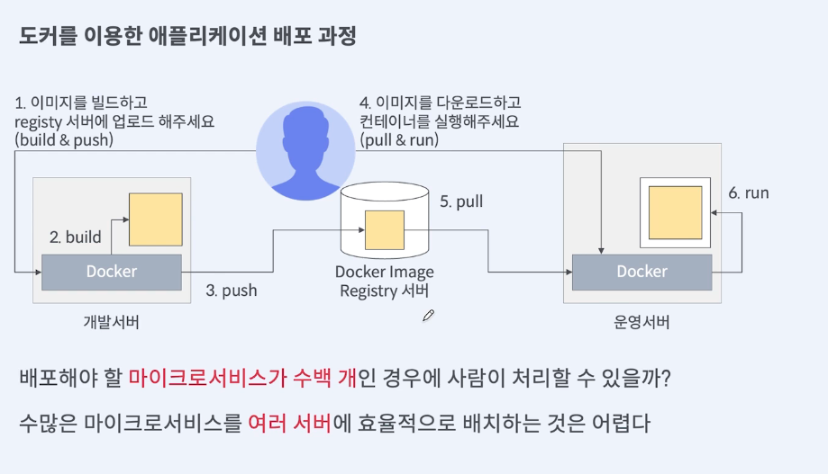

# 쿠버네티스와 클러스터 동작 방식

#### 쿠버네티스가 왜 필요한가.

* 경험을 통해 보는 마이크로 서비스 배포 관리의 어려운 점

#### 쿠버네티스란 무엇인가?

* 구글 컨테이너 관리 시스템(Borg,Omega, Kubernetes) -> 쿠버네티스 설계 목표 확인
* 쿠버네티스 이름을 통해 보는 쿠버네티스 사용법

#### 쿠버네티스 클러스터 구성요소와 동작 방식

* 쿠버네티스가 애플리케이션을 배포하는 방법

### 쿠버네티스가 왜 필요한가

#### 의문점: 수많은 마이크로서비스를 어떤 서버에 어떻게 배포할 것인가?

<figure><figcaption></figcaption></figure>

